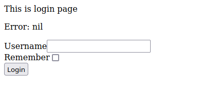

# Echo Session Auth Examples

Usage examples of [`echo-session-auth`](https://github.com/jockerz/echo-session-auth).

## Simple

This is the simplest usage example of [`echo-session-auth`](https://github.com/jockerz/echo-session-auth).

Screenshot:

## Tabler (TODO)

This example show more real use of session auth on `echo`.
We use more modules such as [`gorm`](https://gorm.io) for our DB *ORM* and [`parse-template`](https://github.com/jockerz/parse-template) to help namespacing our *templates*.
